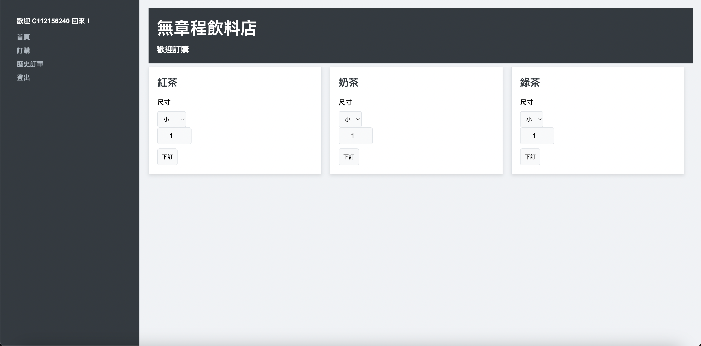
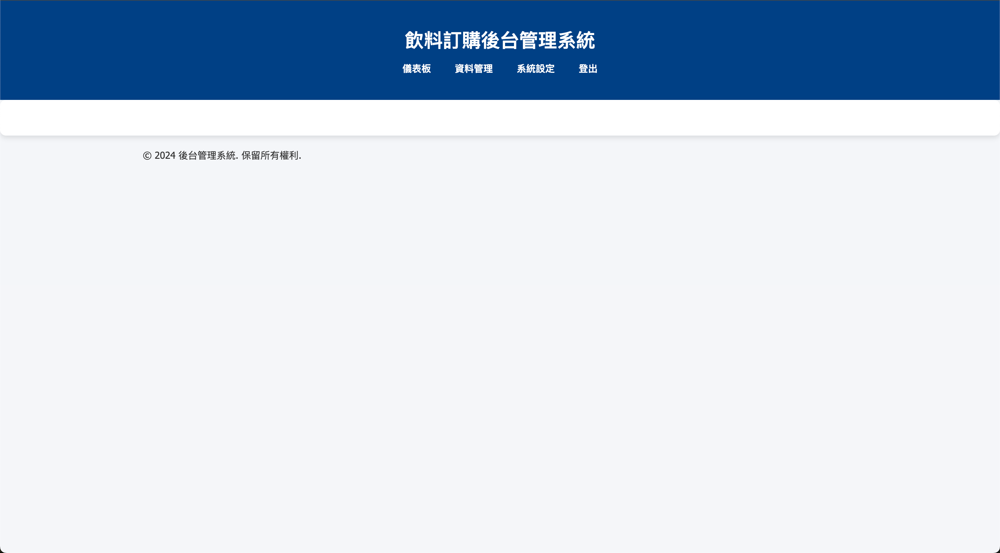

# 飲料訂購系統專題

本專題是基於 PHP 與 MySQL 的飲料訂購系統，使用者可以通過網頁介面完成飲料訂單的管理與查詢，並與 phpMyAdmin 整合以便於資料庫管理。

## 功能簡介

### 1. 訂單功能
- **新增訂單**：用戶可選擇飲品、數量、大小。
- **修改訂單**：可編輯已提交的訂單資訊。
- **刪除訂單**：移除已不需要的訂單。
- **查看訂單詳情**：檢視歷史訂單與當前訂單狀態。

### 2. 會員管理
- **會員註冊與登入**：用戶可創建帳號並登入系統。
- **會員資料管理**：用戶可編輯個人資訊，如聯絡方式等。

### 3. 後台管理
- **訂單管理**：後台管理員可檢視與處理所有訂單。
- **飲品資料管理**：新增、編輯、刪除飲料種類及價格。

## 系統架構

### 前端
- HTML、CSS、JavaScript

### 後端
- PHP
- MySQL 資料庫

### 開發工具
- phpMyAdmin（管理資料庫）
- Visual Studio Code（編輯器）
- XAMPP（伺服器環境）

## 安裝與部署

1. **克隆專案代碼**：
   ```bash
   git clone https://github.com/Ychen1031/mysql-.git
   ```

2. **設置伺服器環境**：
   - 安裝並啟動 XAMPP。
   - 將專案檔案放入 `htdocs` 目錄。

3. **建立資料庫**：
   - 進入 phpMyAdmin，建立名為 `beverageshop` 的資料庫。
   - 匯入專案中的 `beverageshop.sql` 文件，完成資料庫表結構與初始數據的建立。

4. **修改連接設定**：
   - 編輯 `config.php`，配置資料庫連線資訊：
     ```php
     <?php
     define('DB_SERVER', 'localhost');
     define('DB_USERNAME', 'root');
     define('DB_PASSWORD', '');
     define('DB_NAME', 'beverageshop');
     ?>
     ```

5. **啟動專案**：
   - 在瀏覽器中進入 `http://localhost/your_project_folder`。

## 資料庫結構

### 表名與主要欄位

1. **member（會員資料）**
   - `mId`：會員編號
   - `name`：使用者名稱
   - `phone`：電話
   - `password`：密碼
   - `email`：電子郵件

2. **order1（訂單資料）**
   - `mId`：會員編號
   - `oId`：飲料編號
   - `quantity`：數量
   - `orderTime`：訂單日期

3. **product（飲品資料）**
   - `pId`：飲品編號
   - `pName`：飲品名稱
   - `category`：類別
   - `price`：價格

## 預覽截圖

### 主頁面
  
**網址**：  
[http://localhost/mysql-/front/pages/Frontstage.html#](http://localhost/mysql-/front/pages/Frontstage.html#)

---

### 訂單管理
  
**進入網址**：  
[http://localhost/mysql-/front/pages/Frontstage.html#](http://localhost/mysql-/front/pages/Frontstage.html#)  

**登入資訊**：  
- **帳號**：`admin`  
- **密碼**：`123`


